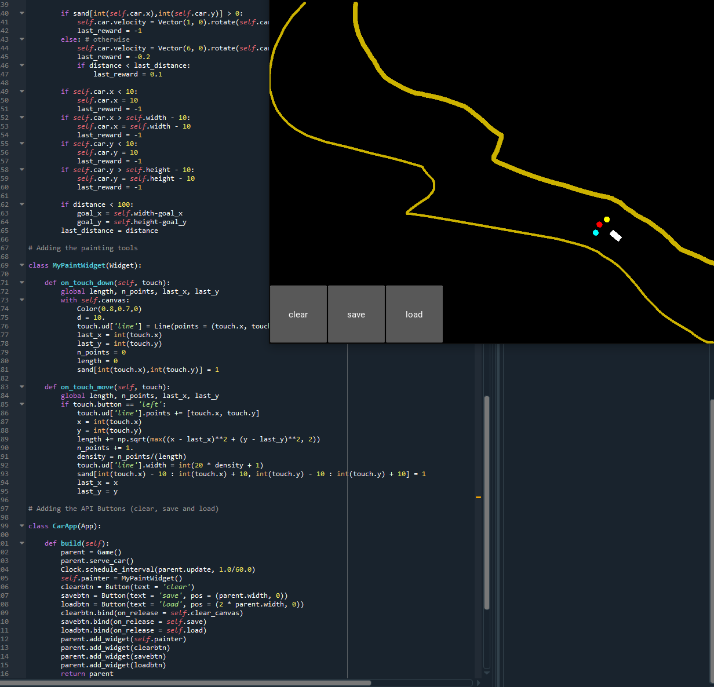

</a>

<!-- [](http://fvcproductions.com) -->


# Self-Driving Car

> Deep Q learning 

> Python build and Graphics

***Code peak ***

[]()

- Deep Q-Learning is the result of combining Q-Learning with an Artificial Neural Network.
- The states of the environment are encoded by a vector which is passed as input into the Neural Network.
- Then the Neural Network will try to predict which action should be played, by returning as outputs a Q-value for each of the possible actions. Eventually, the best action to play is chosen by either taking the one that has the highest Q-value, or by overlaying a Softmax function. 

> GIF Tools

- Used <a href="http://recordit.co/" target="_blank">**Recordit**</a> to create quicks screencasts of your desktop and export them as `GIF`s.

**Self-Driving car quick view**


---

## Table of Contents (Optional)

> If your `README` has a lot of info, section headers might be nice.

- [Installation](#installation)
- [Features](#features)
- [Contributing](#contributing)
- [Team](#team)
- [FAQ](#faq)
- [Support](#support)
- [License](#license)


---


## Installation

- With a few lib set up we can start!!

### Clone

- Clone this repo to your local machine using `https://github.com/charlesZ-byte/Self_Driving_Car.git`

### Setup

- If you want more syntax highlighting, format your code like this:

> update and install this package first

```shell
$ brew update
```

> now install npm and bower packages

```shell
$ npm install
$ bower installpip install torch torchvision
```
> Install pytorch we are good to go

```shell
$ brew install python
$ pip install torch torchvision
```
- For all the possible languages that support syntax highlithing on GitHub (which is basically all of them), refer <a href="https://github.com/github/linguist/blob/master/lib/linguist/languages.yml" target="_blank">here</a>.

---

## Features
- Run ai.py and draw a path from top let to top right
- Train the car to follow the path
- Save for future test
- Load previous tested Q learning model

---

## Contributing

> To get started...

### Step 1

- **Option 1**
    - 🍴 Fork this repo!

- **Option 2**
    - 👯 Clone this repo to your local machine using `https://github.com/joanaz/HireDot2.git`

### Step 2

- **HACK AWAY!** 🔨🔨🔨

### Step 3

- 🔃 Create a new pull request using <a href="https://github.com/joanaz/HireDot2/compare/" target="_blank">`https://github.com/joanaz/HireDot2/compare/`</a>.

---

## FAQ

- **How do play the car model?**
    - It is easy, just draw the path from top left to bottom right, the car will learn itself, isn't is cool?

---

## Support

Reach out to me at one of the following places!

- Website at <a href="http://www.charleszhang0502.com" target="_blank">`www.charleszhang0502.com`</a>
- LinkedIn at <a href="www.linkedin.com/in/shuming-zhang52" target="_blank">`www.linkedin.com/in/shuming-zhang52`</a>

---

## License

[](http://badges.mit-license.org)

- **[MIT license](http://opensource.org/licenses/mit-license.php)**
- Copyright 2015 © <a href="http://fvcproductions.com" target="_blank">FVCproductions</a>.

